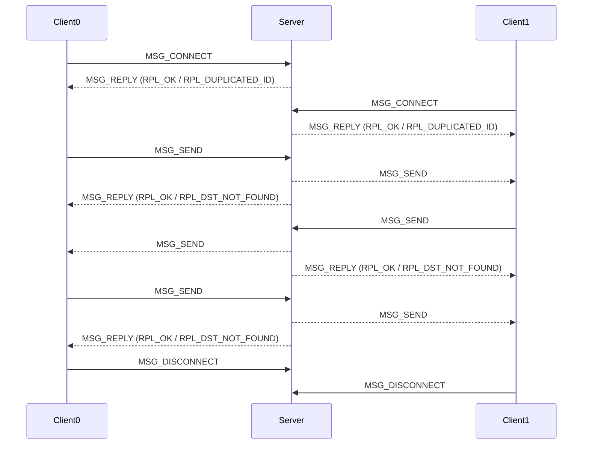

# 基于 Winsock 的聊天程序实现

代码已上传至 [GitHub](https://github.com/JuniMay/winsock-chat)

## 聊天协议设计

协议设计以及协议封装的内容位于 `src/protocol/` 目录下。

### 聊天协议语法格式

 所设计的聊天协议共包含四种不同的封装格式。每个封装格式可以划分为协议头和协议体。协议头包含了消息类型以及整个消息数据包的长度。

```
+-------+-------+
|  TYPE |  LEN  |
+-------+-------+
```

其中消息类型和长度各占用四字节，规定一个消息包的长度最大为 65535 个字节。如此设计的原因是为了防止消息发送得过快而出现多个信息被打包为单个数据包发送的情况。根据协议头中的类型和长度以及 `recv` 函数返回的接收长度就可以对连在一起的数据进行正确解析。

消息的类型共设计了 8 种。

1. `MSG_NONE`：一条空消息。
2. `MSG_CONNECT`：连接到服务器（在服务器端标记自己，不同于使用 socket 连接上服务器）。
3. `MSG_DISCONNECT`：从服务器断开连接。
4. `MSG_SEND`：发送一条消息。
5. `MSG_JOIN`：加入聊天室。
6. `MSG_LEAVE`：离开聊天室。
7. `MSG_REPLY`：服务器返回消息。

此外，对于消息体共设计四种封装方式

1. `CONN` 类型格式，用于与服务器连接和断开。其格式如下

   ```
   +-------+-------+-------+
   |  TYPE |  LEN  |  SRC  |
   +-------+-------+-------+
   ```

2. `SEND` 类型格式，用于通过服务器发送消息。其格式如下

   ```
   +-------+-------+-------+-------+-------+--------------
   |  TYPE |  LEN  |  SRC  |  DST  | FORMAT|   DATA ...    
   +-------+-------+-------+-------+-------+--------------
   ```

   其中 `FORMAT` 预留为消息体的格式，编程实现中暂时没有使用。消息体的长度由头部的长度字段确定。`SRC` 标识发送消息的用户，`DST` 标识接收消息的用户（或者聊天室）。

   在这一格式中并不指定消息的编码而只是表示一系列的字节数据，但是在客户端和服务端的实现中会默认使用 `wchar_t` 即宽字符来解析数据从而支持 ASCII 之外的字符。

1. `ROOM` 类型格式，控制聊天室。 其格式如下
   
   ```
   +-------+-------+-------+-------+
   |  TYPE |  LEN  |  SRC  |  DST  |
   +-------+-------+-------+-------+
   ```

   其中 `SRC` 标识发送消息的用户，`DST` 标识接收消息的聊天室。这一格式可用于加入、退出聊天室。

2. `REPLY` 类型格式，用于服务器向客服端返回操作结果。其格式如下

   ```
   +-------+-------+-------+
   |  TYPE |  LEN  |  RPL  |
   +-------+-------+-------+
   ```

   其中 `RPL` 为服务器返回的消息类型。共有一下七种

   1. `RPL_NONE`：空消息。
   2. `RPL_OK`：操作成功。
   3. `RPL_SEND_FAILED`：发送消息失败。
   4. `RPL_DUPLICATED_ID`：尝试连接时发现有重复的客户端标识符。
   5. `RPL_DST_NOT_FOUND`：未找到消息发送的目标
   6. `RPL_ROOM_NOT_FOUND`：未找到聊天室而离开失败
   7. `RPL_NOT_IN_ROOM`：未加入聊天室而离开失败

### 聊天协议的语义

在聊天协议语法格式的基础上，进一步阐述聊天协议的语义。

首先，每一个客户端在启动时都需要指定一个标识符，一个合法的标识符应当能够使用一个 32 位整数进行表示。

#### 与服务器的连接和断开

使用 `MSG_CONNECT` 和 `MSG_DISCONNECT` 与服务器进行连接和断开。此处的连接的含义是将自己（客户端）接入服务端的聊天网络中，并且在服务端标记自身的存在。而断开连接则表示退出，自己的标识符在聊天网络中不再有效。

这两种信息都使用 `CONN` 格式进行封装，`SRC` 字段即位自身的标识符。

#### 聊天室

客户端可以使用 `MSG_JOIN` 和 `MSG_LEAVE` 加入和退出聊天室，这两种信息使用 `ROOM` 类型格式进行封装，`SRC` 表示发起请求的客户端，`DST` 表示希望加入或者离开的聊天室标识符。注意聊天室标识符与客户端标识符一样也需要能够使用一个 32 位整数表示，并且均不能冲突。

对于一个加入聊天室的请求，若请求加入的聊天室不存在，服务端会创建一个新的聊天室并且将用户加入。若聊天室存在则直接加入。

一个不在聊天室内的用户可以向聊天室发送信息，但是在其加入聊天室之前都不能够收到聊天室内的信息。

#### 信息的发送

客户端可以使用 `MSG_SEND` 进行消息发送，服务端会将接收到的消息转发到对应的目标。`MSG_SEND` 使用 `SEND` 格式进行封装。其中 `SRC` 为发送信息的客户端标识，`DST` 为接收信息的客户端或者聊天室的标识符。如果 `DST` 是一个聊天室，服务端会向所有在这一聊天室内的客户端转发这一消息。

#### 服务端的回复

服务端的回复使用 `MSG_REPLY` 进行发送，并且使用 `REPLY` 格式进行封装。对于每一个需要经过服务器的请求和操作，服务器都会在收到消息并且完成操作之后回复一个内容以告诉客户端请求成功被完成或是出现了错误。

### 聊天协议的时序

一个双人聊天的交互过程可以表示如下：



客户端首先需要使用自己的标识符向服务器请求连接（事实上是加入聊天网络），服务器会返回一个操作结果。如果连接成功，客户端就可以向服务器发送消息，服务器会将消息转发给目标客户端。如果连接失败，客户端需要重新选择标识符再次尝试连接。

之后客户端可以将消息发送到服务器并且指定接收者，服务器会根据接收者进行转发。如果消息的接收者是一个聊天室，那么服务器会向当前加入聊天室的所有用户进行广播。如果消息的接收者是一个用户，那么服务器会将消息转发给目标用户。如果消息的接收者不存在，那么服务器会向发送者返回一个操作结果。

客户端可以在任何时候向服务器发送断开连接的请求，服务器会将客户端从聊天网络中移除。

### 聊天协议的辅助函数

根据发送消息的类型定义了不同的封装函数，便于消息封装的实现。

```c
/// Wrap a connect message into a buffer.
length_t protocol_wrap_msg_connect(ident_t ident, uint8_t buffer[]);
/// Wrap a disconnect message into a buffer.
length_t protocol_wrap_msg_disconnect(ident_t ident, uint8_t buffer[]);
/// Wrap a send message into a buffer.
length_t protocol_wrap_msg_send(
  ident_t src,
  ident_t dst,
  format_t format,
  length_t data_len,
  uint8_t data[],
  uint8_t buffer[]
);
/// Wrap a join message into a buffer.
length_t protocol_wrap_msg_join(ident_t src, ident_t dst, uint8_t buffer[]);
/// Wrap a leave message into a buffer.
length_t protocol_wrap_msg_leave(ident_t src, ident_t dst, uint8_t buffer[]);
/// Wrap a reply message into a buffer.
length_t protocol_wrap_msg_reply(reply_code_t code, uint8_t buffer[]);
```

协议的定义以及协议辅助函数的实现均使用 C 完成。

## 服务端程序的设计实现

服务端实现的有关代码位于 `src/server/` 目录下。

在服务端的实现中，首先定义成了一个服务端的状态类，包括了其端口、最大支持的客户端数量、主套接字、地址、是否在运行等。之后为每一个客户端都创建一个对应的套接字用于接收消息，并且为了实现群发，为每一个套接字定义一个互斥锁。此外，还记录每一个聊天室内的客户端数量。

在服务端的状态之外，还定义了一个接收处理和一个退出处理函数，二者都在单独的线程中运行。

```cpp
/// State of the server
struct ServerState {
  /// The port of the server
  size_t port;
  /// The maximum number of clients
  size_t max_clients;
  /// The master socket
  SOCKET master;
  /// The server address
  struct sockaddr_in server;

  bool running = true;

  /// The clients
  std::unordered_map<ident_t, SOCKET> clients;
  /// Mutex for sockets
  std::unordered_map<SOCKET, std::shared_ptr<std::mutex>> socket_mutexes;
  /// The rooms
  std::unordered_map<ident_t, std::unordered_set<ident_t>> rooms;

  /// Mutex
  std::mutex mutex;

  /// Print a message to stdout with a prefix
  void log(const std::wstring& msg);
  /// Initialize the server
  int init(size_t port, size_t max_clients);
  /// Main loop of the server
  void loop();
  /// Show information about the server
  void show_info();
  /// Cleanup the server
  void cleanup();
};

/// The handler for receiving messages from the client.
void server_recv_handler(ServerState* state, SOCKET socket);

/// The handler for quitting the server.
void server_quit_handler(ServerState* state);
```

`server_recv_handler` 会从特定的客户端对应的套接字中接收信息并且进行处理，并且将解析之后的信息打印出来。根据信息的类型，服务器会进行处理或转发，并且向客户端回复一个结果。

## 客户端程序的设计实现

客户端实现的有关代码位于 `src/client` 目录下。

与服务端类似，客户端也首先实现了一个状态类型，记录了用于与服务器连接的套接字、服务器地址、客户端的标识符、用于线程同步的互斥锁以及正在运行的标识符。

```cpp
/// The state of the client
struct ClientState {
  /// The socket to the server
  SOCKET s;
  /// The server address
  struct sockaddr_in server;
  /// The ident of the client
  ident_t ident;
  /// Mutex
  std::mutex mutex;
  /// Whether the client is running
  bool running = true;
  
  /// Print a message to stdout with a prefix
  void log(const std::wstring& msg);
  /// Initialize the client
  int init(char* ip, size_t port);
  /// Main loop of the client
  void loop();
  /// Show information about the connected server.
  void show_info();
  /// Cleanup the client
  void cleanup();
};

/// The handler for receiving messages from the server.
void client_recv_handler(ClientState* state);
```

由于客户端需要发送不同的信息到服务器，所以在 `ClientState::loop()` 中会首先解析用户输入，以发送信息为例，用户的输入可以是如下格式：

```
send <dst> "<content>"
```

解析的方法是简单地对输入的内容进行分词，并且根据第一个词进行操作。

